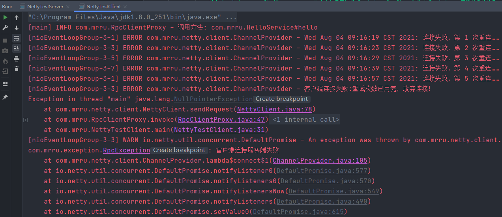

# Netty-For-RPC

---

实践项目-应用Netty框架完成RPC通信

## 关于对象序列化过程
假设客户端测试 使用的是 new HessianSerializer()

假设服务端测试 使用的是 new KryoSerializer()

仅仅意味着客户端和服务端**编码**时所采用的序列化器，对于**解码**，会根据传输协议传过来的序列化器的Code，创建对应的反序列化器进行解码！
## 增加了Netty客户端连接失败重试机制

## Protostuff
Protostuff是基于谷歌Protocol Buffer的Java序列化库。

Protocol Buffer门槛更高，因为需要编写.proto文件，再把它编译成目标语言，这样使用起来就很麻烦。

但是现在有了protostuff之后，就不需要依赖.proto文件了，他可以直接对POJO进行序列化和反序列化，使用起来非常简单。