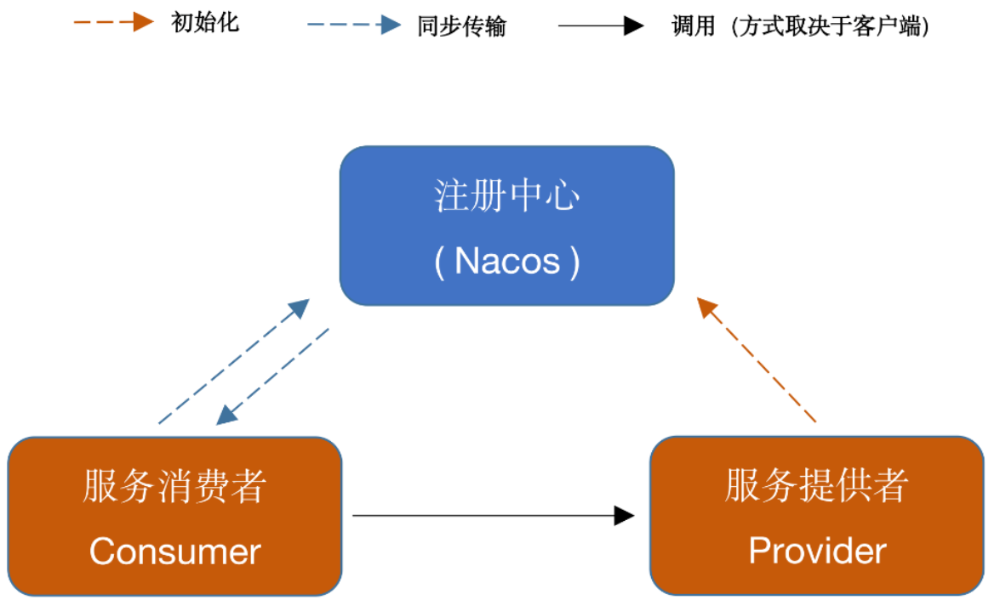

# Netty-For-RPC

Netty-For-RPC是一款基于 Nacos 实现的 RPC 框架。网络传输实现了基于 Java 原生 Socket 与 Netty 版本，并且实现了多种序列化与负载均衡算法。


## 一、架构



消费者调用提供者的方式取决于消费者的客户端选择，如选用原生 Socket 则该步调用使用 BIO，如选用 Netty 方式则该步调用使用 NIO。如该调用有返回值，则提供者向消费者发送返回值的方式同理。

## 二、特性

- 实现了基于 Java 原生 Socket 传输与 Netty 传输两种网络传输方式
- 实现了四种序列化算法，Json 方式、Kryo 算法、Hessian 算法与 Google Protobuf 方式（默认采用 Kryo方式序列化）
- 实现了两种负载均衡算法：随机算法与轮转算法
- 使用 Nacos 作为注册中心，管理服务提供者信息
- 消费端如采用 Netty 方式，会复用 Channel 避免多次连接
- 如消费端和提供者都采用 Netty 方式，会采用 Netty 的心跳机制，保证连接
- 接口抽象良好，模块耦合度低，网络传输、序列化器、负载均衡算法可配置
- 实现自定义的通信协议
- 服务提供侧自动注册服务

## 三、模块概览

- **roc-api**	——	通用接口
- **rpc-common**	——	实体对象、工具类等公用类
- **rpc-core**	——	框架的核心实现
- **test-client**	——	测试用消费侧
- **test-server**	——	测试用提供侧

## 四、传输协议

调用参数与返回值的传输采用了如下 MRF 协议（ My-RPC-Framework 首字母）以防止粘包：

```
+---------------+---------------+-----------------+-------------+
|  Magic Number |  Package Type | Serializer Type | Data Length |
|    4 bytes    |    4 bytes    |     4 bytes     |   4 bytes   |
+---------------+---------------+-----------------+-------------+
|                          Data Bytes                           |
|                   Length: ${Data Length}                      |
+---------------------------------------------------------------+
```

| 字段            | 解释                                                         |
| :-------------- | :----------------------------------------------------------- |
| Magic Number    | 魔数，表识一个 协议包，0xCAFEBABE                            |
| Package Type    | 包类型，标明这是一个调用请求还是调用响应                     |
| Serializer Type | 序列化器类型，标明这个包的数据的序列化方式                   |
| Data Length     | 数据字节的长度                                               |
| Data Bytes      | 传输的对象，通常是一个`RpcRequest`或`RpcClient`对象，取决于`Package Type`字段，对象的序列化方式取决于`Serializer Type`字段。 |

## 五、How to use

### 1 、定义调用接口

```java
/**
 * 测试用api的接口
 **/
public interface HelloService
{
    String hello(HelloObject object);
}
```

### 2、在服务提供侧实现该接口

```java
/**
 * 真正的接口的实现类
**/
@Service  //不要忘了注解
public class HelloServiceImpl implements HelloService
{
    private static final Logger logger = LoggerFactory.getLogger(HelloServiceImpl.class);

    @Override
    public String hello(HelloObject object)
    {
        logger.info("接收到消息: {}", object.getMessage());
        return "本次处理通过Netty，这是调用的返回值，id = " + object.getId();
    }
}
```


### 3、编写服务提供者

```java
/**
 * 测试用Netty服务提供者（服务端）
 **/
@ServiceScan //不要忘了注解
public class NettyTestServer
{
    public static void main(String[] args)
    {
        //启动服务，并监听端口9999的客户端连接, 手动传入序列化器(默认去RpcServer查看)
        NettyServer nettyServer = new NettyServer("127.0.0.1", 8888, CommonSerializer.PROTOBUF_SERIALIZER);

        //自动注册此根目录包下的 标有 @Service的类并进行注册
        nettyServer.start();
    }

}
```

### 4、在服务消费侧远程调用

```java
/**
 * 测试用Netty消费者
 **/
public class NettyTestClient
{

    public static void main(String[] args)
    {
        //初始化客户端，手动传入序列化器(默认去RpcClient查看)，并传入proxy对象中
        //客户端不需要指定 服务端地址
        RpcClient  client = new NettyClient(CommonSerializer.PROTOBUF_SERIALIZER, new RandomLoadBalancer());
        RpcClientProxy proxy = new RpcClientProxy(client);

        //生成代理对象
        HelloService helloService = proxy.getProxy(HelloService.class);

        //要发送的数据
        HelloObject object = new HelloObject(84, "8.2号学Rpc");

        //调用invoke，将要调用的方法 封装在RpcRequest对象中
        //连接服务器，并调用客户端 发送数据,后经过 CommonEncoder、CommonDecoder 传到Socket连接中
        //阻塞获得返回结果
        String result = helloService.hello(object);

        System.out.println(result);

        //再输出一个 bye,netty
        ByeService byeService = proxy.getProxy(ByeService.class);
        System.out.println(byeService.bye("Netty"));

    }

}
```

### 5 、启动

启动前确保Nacos运行在本地`8848`端口，依次启动服务提供者，再启动服务消费者。

服务提供者 -- **接收到消息：来自Netty消费者的测试msg**

服务消费者 -- **本次处理通过Netty，这是调用的返回值，id = 84**

## 六、TODO
