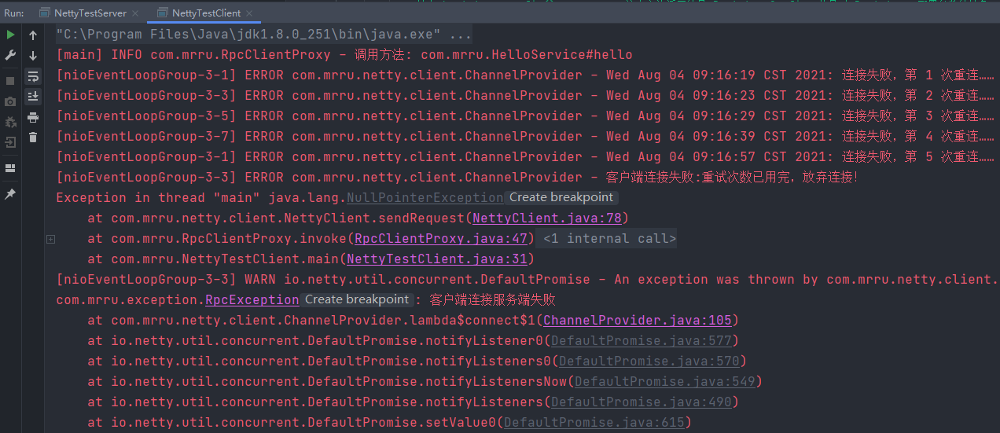
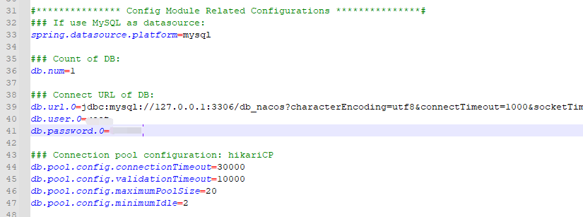
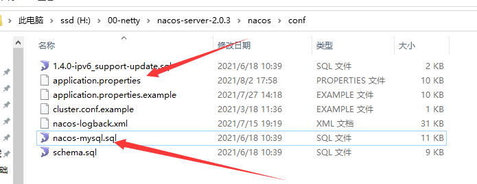
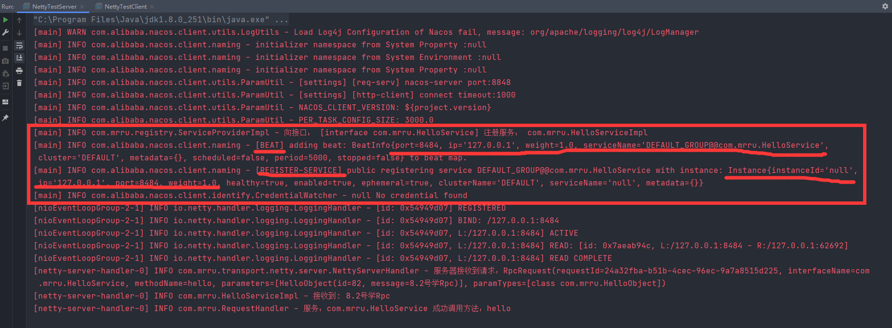
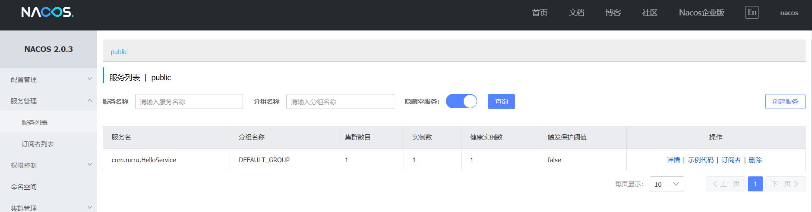
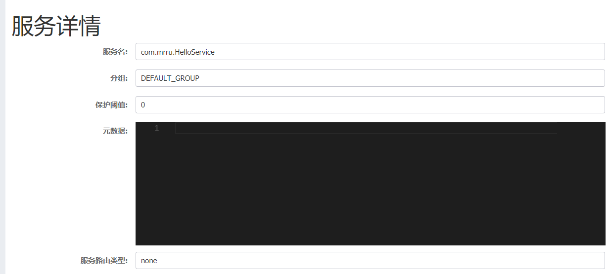
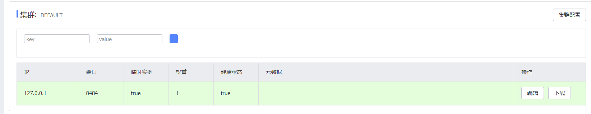
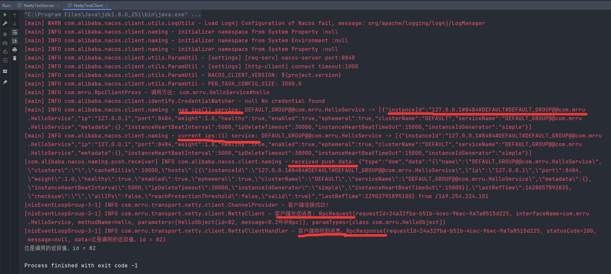
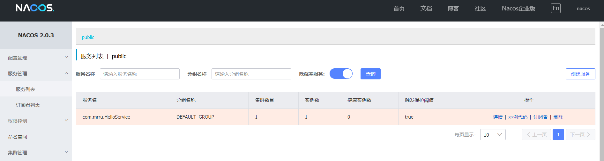

## 关于对象序列化过程
假设客户端测试 使用的是 new HessianSerializer()

假设服务端测试 使用的是 new KryoSerializer()

仅仅意味着客户端和服务端**编码**时所采用的序列化器，对于**解码**，会根据传输协议传过来的序列化器的Code，创建对应的反序列化器进行解码！
## Netty客户端连接失败重试机制

## Protostuff
Protostuff是基于谷歌Protocol Buffer的Java序列化库。

Protocol Buffer门槛更高，因为需要编写.proto文件，再把它编译成目标语言，这样使用起来就很麻烦。

但是现在有了protostuff之后，就不需要依赖.proto文件了，他可以直接对POJO进行序列化和反序列化，使用起来非常简单。

## nacos配置
修改启动为单机版，配置conf：设置好对应的mysql环境

去mysql执行sql文件语句，建库db_nacos和图一对应即可。

## nacos注册中心测试结果
测试前提前开启nacos

NettyTestServer

---
Nacos网页端：http://localhost:8848/nacos/#/serviceManagement?dataId=&group=&appName=&namespace=

---

NettyTestClient

关闭NettyTestServer服务后

---

## 自动注册
目前的规则是 一个接口只能有一个实现类，并且要在同一个根包下，实现类标记@Service注解，启动类标记@ServiceScan注解；

这样启动类启动后，会在自己的根包下寻找 所有标记@Service注解的类，进行自动注册!

